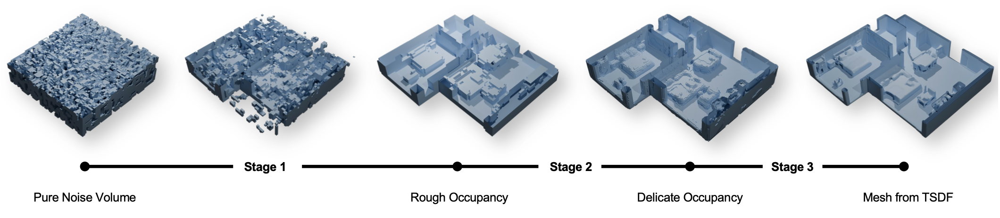
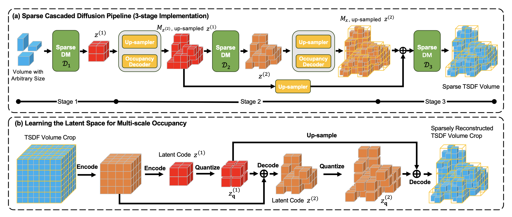

# Updates
[2024-10-05] Checkpoints added.

[2024-10-05] More concrete instructions added.

# Overview
This is the official implementation of our  paper: 

**[CVPR2024] DiffInDScene: Diffusion-based High-Quality 3D Indoor Scene Generation**\
*Xiaoliang Ju\*, Zhaoyang Huang\*, Yijin Li, Guofeng Zhang, Yu Qiao, Hongsheng Li*

[[paper]](https://openaccess.thecvf.com/content/CVPR2024/papers/Ju_DiffInDScene_Diffusion-based_High-Quality_3D_Indoor_Scene_Generation_CVPR_2024_paper.pdf)[[sup]](https://openaccess.thecvf.com/content/CVPR2024/supplemental/Ju_DiffInDScene_Diffusion-based_High-Quality_CVPR_2024_supplemental.pdf)[[arXiv]](https://arxiv.org/abs/2306.00519)[[project page]](https://akirahero.github.io/diffindscene/)


DiffInDScene generates large indoor scene with a coarse-to-fine fashion:

which consists of a multi-scale PatchVQGAN for occupancy encoding and a cascaded sparse diffusion model.


This repo provides or will provide

  - [x] code for data processing
  - [x] code for inference
  - [x] code for training
  - [x] checkpoint
  - [ ] extension to other dataset


# Dependency 
Our sparse diffusion is implemented based on [TorchSparse](https://github.com/mit-han-lab/torchsparse). For it is still under rapid developing, we provide the commit hash of the version we used: ``1a10fda15098f3bf4fa2d01f8bee53e85762abcf``.

The main codebases of our framework includes
[VQGAN](https://github.com/CompVis/taming-transformers),
[VQ-VAE-2](https://github.com/rosinality/vq-vae-2-pytorch), and
[Diffusers](https://github.com/huggingface/diffusers), and we only melt the necessary parts into our repo to avoid code dependency.

We employ [DreamSpace](https://ybbbbt.com/publication/dreamspace/) to texture the generated meshes. You can also substitute it to other similar texturing tools.


# Environment Setup
## Step 1. create a conda environment
```shell
conda create -n diffindscene python=3.9
conda activate diffindscene
```
## Step 2. Install dependencies by pip
```
pip install -r requirements.txt 
```
## Step 3. Setup the torchsparse library
```shell
# for now, we do not support the newest version of torchsparse
# please compile from source code.

git clone git@github.com:mit-han-lab/torchsparse.git
cd torchsparse
git checkout 1a10fda15098f3bf4fa2d01f8bee53e85762abcf
python setup.py install

```

# Inference with checkpoints

## Step 1: Download checkpoints
Download the checkpoints [here](https://huggingface.co/akirahero/diffindscene/tree/main/ckpt). Put all checkpoints in the folder `ckpt`.

## Step 2: Run the inference script

### For unconditional generation
```
conda activate diffindscene
export PYTHONPATH=${PATH_TO_DIFFINDSCENE}:${PYTHONPATH}

# unconditional generation
python main/test.py --cfg_dir utils/config/samples/cascaded_ldm_ucond

```
The results will be saved in `output` folder.

### For conditioned-generation with sketch
```
conda activate diffindscene
export PYTHONPATH=${PATH_TO_DIFFINDSCENE}:${PYTHONPATH}

# conditioned-generation with sketch
python main/test.py --cfg_dir utils/config/samples/cascaded_ldm_sketch_cond
```
The results will be saved in `output` folder. 

More sketch images can be downloaded from [here](https://huggingface.co/akirahero/diffindscene/blob/main/sketch_samples.tar.gz).


# Prepare the Dataset

We mainly use [3D-FRONT](https://tianchi.aliyun.com/specials/promotion/alibaba-3d-scene-dataset) as our dataset.

The [code for data processing](https://github.com/AkiraHero/3dfront_proc) is developed based on the repo [BlenderProc-3DFront](https://github.com/yinyunie/BlenderProc-3DFront) and [SDFGen](https://github.com/christopherbatty/SDFGen).

The pipeline mainly consists of following steps
 * Extract resources from original dataset and join them to a scene.
 * Use blender to remesh the scene to be watertight mesh.
 * Generate SDF of the scene.
 * Compress *.sdf to *.npz

Example scripts:
```shell 
# generate watertight meshes
blenderproc run examples/datasets/front_3d_with_improved_mat/process_3dfront.py ${PATH-TO-3D-FUTURE-model} ${PATH-TO-3D-FRONT-texture} ${MESH_OUT_FOLDER}

# generate SDF for every mesh
sh examples/datasets/front_3d_with_improved_mat/sdf_gen.sh ${MESH_OUT_FOLDER} ${PATH-TO-SDFGen}

# compress *.sdf to *.npz
python examples/datasets/front_3d_with_improved_mat/npz_tsdf.py ${MESH_OUT_FOLDER} ${NPZ_OUT_DIR}
```


# Training from Scratch
Every part of our model corresponds to a individual configuration folder located in `utils/config/samples/`, with an instruction file as `readme.md`.


## The first stage model: PatchVQGAN
Training script:
```
python main/train.py utils/config/samples/tsdf_gumbel_ms_vqgan
```


  
Testing script: 
```
python main/test.py utils/config/samples/tsdf_gumbel_ms_vqgan
```
and the latents will be saved in your designated output path.


## [Optional] Sketch VAE for conditioned generation
```
python main/train.py utils/config/samples/sketch_VAE
```

## Cascaded Latent Diffusion
The cascaded diffusion consists of 3 levels as described in our paper, which can be trained individually by setting "level" variable in `config/samples/cascaded_ldm/model/pyramid_occ_denoiser.yaml`.

The training script is

```
python main/train.py --cfg_dir utils/config/samples/cascaded_ldm
```
and the inference script is
```
python main/test.py --cfg_dir utils/config/samples/cascaded_ldm
```

# Citation
```
@inproceedings{ju2024diffindscene,
  title={DiffInDScene: Diffusion-based High-Quality 3D Indoor Scene Generation},
  author={Ju, Xiaoliang and Huang, Zhaoyang and Li, Yijin and Zhang, Guofeng and Qiao, Yu and Li, Hongsheng},
  booktitle={Proceedings of the IEEE/CVF Conference on Computer Vision and Pattern Recognition},
  pages={4526--4535},
  year={2024}
}
```